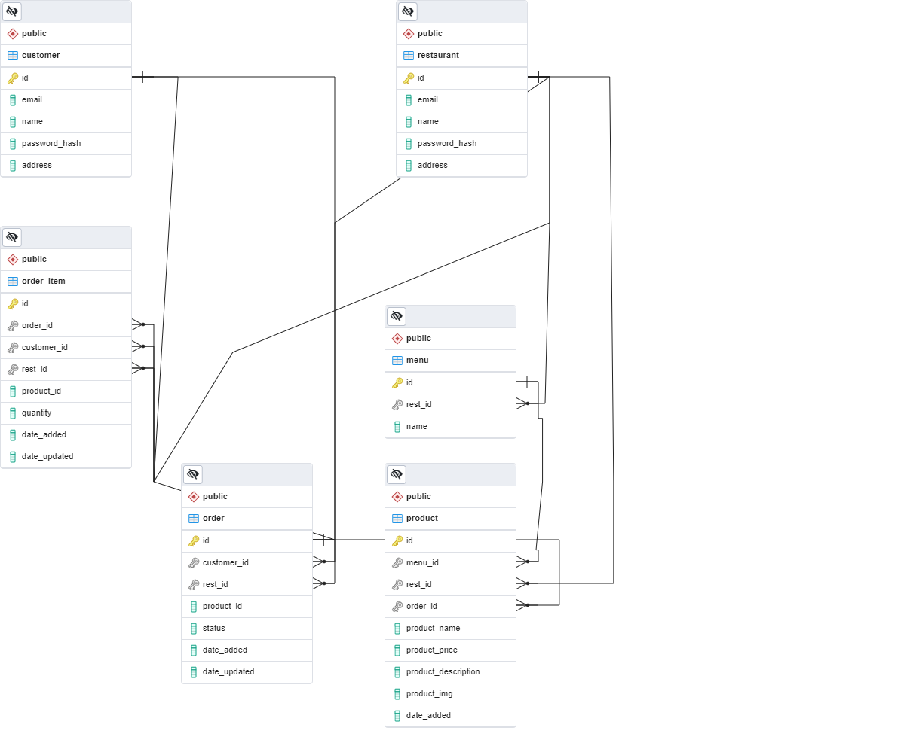

# BURGERZILLA
* Bu proje, hamburger restoranlarından sipariş alan,
siparişin durumunu görüntüleyebilen, sipariş ile
ilgili müşteri/restoran yetkisinde işlemler
yapmayı sağlayan bir REST-API mikro servisidir.

## Proje Bilgileri
* Müşteri; sipariş oluşturabilir, siparişin detayını görüntüleyebilir, siparişini güncelleyebilir, siparişlerini listeleyebilir ve siparişini iptal edebilir.
* Restoran; siparişlerini listeleyebilir, siparişin detayını görüntüleyebilir, siparişi iptal edebilir, siparişin durumu ile ilgili aksiyon alabilir, menü oluşturabilir, menüye ürün ekleyebilir, menüdeki ürünleri listeleyebilir, menüden ürün silebilir, menüdeki ürünleri güncelleyebilir ve menüden ürün silebilir.
* JWT (JSON Web Token) kullanıldığı için müşteri giriş yaptığında oluşturulan token ile doğrulama işlemi yapmadan diğer işlemlerine devam edemiyor. JWT ile ,fonksiyonlarda bir kontrol işlemi yapıldığı için bir müşteri başka bir müşterinin veya restaurantın bilgilerine erişemez ve müdahale edemez, aynı şekilde bir restaurantta başka bir restaurantın veya müşterinin bilgilerine erişemez ve müdahale edemez.

## Kurulum ve Çalıştırma

### Bilgisayarda Çalıştırmak İçin
Proje klonlanır; 

* `git clone https://github.com/Yemeksepeti-Python-Bootcamp/burgerzilla_iremdoganci.git`

Proje dizinine gidilir; 

*`cd burgerzilla_iremdoganci`

Virtual environment oluşturulur 

* `python -m venv env`

Virtual environment aktif hale getiririlr; 

* `. env/bin/activate` (for MacOs) / `env\Scripts\activate` (for Windows)

Gereklilikler yüklenir; 

* `pip install -r requirements.txt`

Ön tanımlı veriler oluşturulur; 
 
* `flask defaultdata`

* `flask run`

### Dockerda Çalıştırmak İçin
* `git clone https://github.com/Yemeksepeti-Python-Bootcamp/burgerzilla_iremdoganci.git`
* `cd burgerzilla_iremdoganci`
* `docker build -t burgerzilla:latest .`
* `docker compose up --build web`

## Proje Yapısı
    📦app
    ┣ 📂api
    ┃ ┣ 📂customer
    ┃ ┃ ┣ controller.py
    ┃ ┃ ┣ dto.py
    ┃ ┃ ┣ service.py
    ┃ ┃ ┣ utils.py
    ┃ ┃ ┗ __init__.py
    ┃ ┣ 📂restaurant
    ┃ ┃ ┣ controller.py
    ┃ ┃ ┣ dto.py
    ┃ ┃ ┣ service.py
    ┃ ┃ ┣ utils.py
    ┃ ┃ ┗ __init__.py
    ┃ ┗ __init__.py
    ┣ 📂auth
    ┃ ┣ controller.py
    ┃ ┣ dto.py
    ┃ ┣ service.py
    ┃ ┣ utils.py
    ┃ ┗ __init__.py
    ┣ 📂models
    ┃ ┣ customer.py
    ┃ ┣ menu.py
    ┃ ┣ order.py
    ┃ ┣ product.py
    ┃ ┣ restaurant.py
    ┃ ┣ schemas.py
    ┃ ┗ __init__.py
    ┣ extensions.py
    ┣ utils.py
    ┗ __init__.py

## API Bilgileri

 * Customer ve restaurant olmak üzere iki kullanıcı var. Ayrı yetkileri olduğu için endpointleri ayrı ayrı tutulmakta.
 * Müşteriye ait; 
    - Müşteri bilgilerini alabildiği `get_customer_data` endpointi
    - Sipariş oluşturabildiği `create_orders` endpointi
    - Tüm siparişlerini alabildiği `get_orders` endpointi
    - Sipariş detaylarını alabildiği `get_order_details` endpointi
    - Siparişini güncelleyebildiği `update_order` endpointi
    - Siparişine ürün ekleyebildiği `add_product_to_order` endpointi
    - Siparişini iptal edebildiği `cancel_order` endpointi var.

* Restorana ait;
    - Restoran bilgilerini alabildiği `get_restauran_data` endpointi
    - Siparişlerini alabildiği `get_restaurant_orders` endpointi
    - Siparişlerinin detayını alabildiği `get_restaurant_order_details` endpointi
    - Sipariş güncelleyebildiği `update_order_status` endpointi
    - Sipariş iptal edebildiği `cancel_restaurant_order` endpointi
    - Menü oluşturabildiği `create_menu` endpointi
    - Menünün ürünlerini listeleyebildiği `get_menu_products_list` endpointi
    - Menüyü güncelleyebildiği `update_menu` endpointi
    - Menüye ürün ekleyebildiği `insert_product_to_menu` endpointi
    - Menüden ürün silebildiği `delete_product` endpointi var.

            ┣ 📂api
            ┃ ┣ 📂customer         # Müşteriye ait işlemlerin yapıldığı
                                    dosyalar bu klasör içinde yer alır.  
            ┃ ┃ ┣ controller.py    # Müşteriye ait endpointler
                                    burada oluşturulur.Routler belirtilir.
            ┃ ┃ ┣ dto.py           # Api'nin modelleri burada
                                     oluşturulur. Hangi verinin hangi
                                     formatta alınacağı belirlitir.
            ┃ ┃ ┣ service.py       # Müşteri ile ilgili yapılabilecek
                                    işlemler ve müşterinin yetkisi olan işlemler
                                    fonksiyonlar olarak burada oluşturulur.
            ┃ ┃ ┣ utils.py         # Hata mesajları burada belirlenir.
            ┃ ┃ ┗ __init__.py

            ┃ ┣ 📂restaurant       # Restorana ait işlemlerin yapıldığı
                                    dosyalar bu klasör içinde yer alır.
            ┃ ┃ ┣ controller.py    # Restorana ait endpointler
                                    burada oluşturulur.Routler belirtilir.
            ┃ ┃ ┣ dto.py          # Api'nin modelleri burada
                                    oluşturulur. Hangi verinin hangi
                                    formatta alınacağı belirlitir.
            ┃ ┃ ┣ service.py      # Restoran ile ilgili yapılabilecek
                                    işlemler ve müşterinin yetkisi olan işlemler
                                    fonksiyonlar olarak burada oluşturulur.
            ┃ ┃ ┣ utils.py
            ┃ ┃ ┗ __init__.py
            ┃ ┗ __init__.py

## Model Bilgileri
* Tek veri tabanı üzerinde müşteri tablosu, menu tablosu, order tablosu, order item tablosu, product tablosu ve restaurant tablosu olmak üzere 6 tane tablo oluşturulmuştur.Veri tabanı modelleri bu klasörde yer alır.

        ┣ 📂models            
        ┃ ┣ customer.py      # Customer tablosu oluşturulur.
        ┃ ┣ menu.py          # Menu tablosu oluşturulur.
        ┃ ┣ order.py         # Order tablosu oluşturulur.
        ┃ ┣ product.py       # Product tablosu oluşturulur.
        ┃ ┣ restaurant.py    # Restaurant tablosu oluşturulur.
        ┃ ┣ schemas.py       # Hangi modelde hangi field olduğu
                               burada belirtilir.
        ┃ ┗ __init__.py

## Auth Bilgileri
* Register ve Login işlemlerinin yapılabilmesi için iki tane endpoint burada yer alır. Müşteri ya da Restaurant olarak sistemde kayıt oluşturulabilir ve kayıt bilgileri ile giriş işlemi yapılabilir. Authentication işlemleri yapılarak email,şifre, kullanıcı kontrolleri burada yapılır.

        ┣ 📂auth             
        ┃ ┣ controller.py   # Login ve Register endpointleri
                              burada yer alır.
        ┃ ┣ dto.py          # Api'nin modelleri burada
                              oluşturulur. Hangi verinin hangi
                              formatta alınacağı belirlitir.
                              Namespace tanımları burada yapılır.
        ┃ ┣ service.py      # Veri tabanı ile yapılacak işlemler
                              burada yer alır. Gerektiğinde hata mesajları gönderilir.
        ┃ ┣ utils.py        # Doğrulama işlemleri burada
                              yapılır.
        ┃ ┗ __init__.py

## Veri Tabanı Şeması
 
